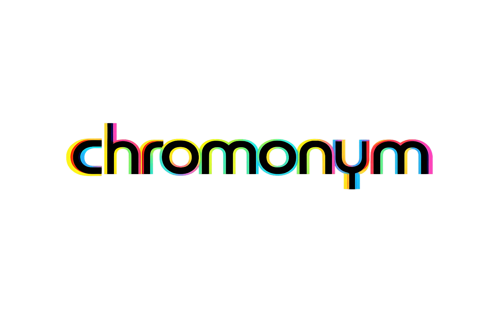
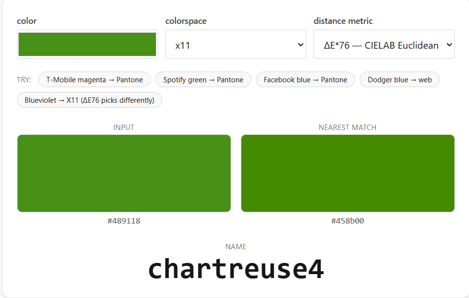

<p align="center">
  
</p>

<p align="center">
  <a href="https://simiancraft.github.io/chromonym/">
    
  </a>
</p>

# chromonym

[](https://www.npmjs.com/package/chromonym)
[](https://www.npmjs.com/package/chromonym)
[](https://github.com/simiancraft/chromonym/actions/workflows/ci.yml)
[](https://codecov.io/github/simiancraft/chromonym)
[](https://bundlephobia.com/package/chromonym)

<p align="center">
  <code>identify</code> &nbsp;•&nbsp; <code>resolve</code> &nbsp;•&nbsp; <code>convert</code>
</p>

**The last color-naming library you'll ever need.** One API — `identify`, `resolve`, `convert` — works against any palette you throw at it. Ships CSS, X11, Pantone, and Crayola out of the box; bring your own (brand colors, paint chips, game factions, chart themes) with full TypeScript inference and zero registration. Six distance metrics — from fast Euclidean to industry-standard CIEDE2000 and OKLAB. Tree-shakes to the bone — you only pay for palettes you import.

<p align="center">
  <a href="https://simiancraft.github.io/chromonym/">
    
  </a>
</p>

Because "it's sort of magenta-ish, maybe?" doesn't copy-paste into code — and naming a color is the same problem whether your palette is CSS, Pantone, your company's brand kit, or a homebrew set of faction colors. Chromonym treats every palette as a first-class `Palette<Name>` object and runs the same nearest-neighbor machinery over all of them.

For color *manipulation* (mixing, scales, gamut mapping), reach for [`chroma-js`](https://gka.github.io/chroma.js/) or [`color.js`](https://colorjs.io/) — chromonym is the tool for *naming*.

```ts
import { identify, resolve, convert, pantone, crayola, web, type Palette } from 'chromonym';

// Your palette — defined inline, type-checked, no registration. Works the
// same as the built-in ones because that's the whole point.
const brand = {
  name: 'acme-brand',
  colors: { 'acme red': '#ff2a3b', 'acme ink': '#0a0f2c', 'acme mist': '#e6ecf5' },
  normalize: (s: string) => s.toLowerCase().replace(/[^a-z0-9]/g, ''),
  defaultMetric: 'deltaEok',
} as const satisfies Palette;

identify('#ff2b3c', { palette: brand })         // 'acme red'
resolve('Acme Ink', { palette: brand })         // '#0a0f2c'

// Built-in palettes follow the identical shape — CSS, X11, Pantone, Crayola out of the box.
identify('#ff8080')                                // 'lightcoral' (web is the default)
identify('#663399')                                // 'rebeccapurple'
identify('#E20074', { palette: pantone })       // '213 C' — T-Mobile magenta
identify('#E20074', { palette: crayola })       // 'Razzmatazz' — the closest Crayon
resolve('Pantone 185 C', { palette: pantone })  // '#e4002b'

// Cross-palette in one call: parse input as a name from `source`, return nearest in `palette`.
identify('rebeccapurple', { palette: pantone, source: web })  // '267 C'

// Format conversion: HEX / RGB / RGBA / HSL / HSV (palette-free, tree-shakes cleanly)
convert('#ff0000', { format: 'HSL' })              // 'hsl(0, 100%, 50%)'
convert({ h: 120, s: 100, l: 50 }, { format: 'HEX' })  // '#00ff00'

// Same convert API understands palette names both ways when you pass one:
// name in → any structural format out; color in → exact palette key out.
// `'NAME'` is an exact reverse lookup (throws on miss; use `identify` for fuzzy).
convert('185 C', { palette: pantone, format: 'HSL' })     // 'hsl(349, 100%, 45%)'
convert('#e4002b', { palette: pantone, format: 'NAME' })  // '185 C'  (exact match)
convert('acme red', { palette: brand, format: 'RGB' })    // 'rgb(255, 42, 59)'
```

The identification machinery is palette-agnostic — RAL, HKS, NCS, Munsell, or a bespoke in-house set are the same amount of work (a small file each, or a single object literal). PRs welcome; meanwhile, BYO lets you ship today.

## Install

```sh
bun add chromonym
pnpm add chromonym
yarn add chromonym
npm install chromonym
```

## Migrating from 1.x

v2 collapsed the five-verb draft API (`identify`, `identifyAll`, `translate`, `resolve`, `convert`) into **three verbs** by folding the duplicates into options on existing verbs. Mechanical rewrites:

```ts
// v1 → v2
identifyAll(color, { palette, k: 3 })          // → identify(color, { palette, k: 3 })
translate(name, { from: web, to: pantone })    // → identify(name, { palette: pantone, source: web })
```

`resolve` and `convert` are unchanged. If you were only using those two, no edits are needed. See `CHANGELOG.md` for the full list of breaking changes.

## API

Three verbs. All accept an optional `opts` object; defaults fire when omitted.

### Options × verbs, at a glance

chromonym's API is deliberately tight: **three verbs, five options, no new nouns per feature**. Options earn their seat on each verb only where the semantics fit. Same-named options mean the same thing everywhere they appear.

| | `identify` | `resolve` | `convert` |
|---|:---:|:---:|:---:|
| `palette` | ✓ target (default: `web`) | ✓ source (default: `web`) | ✓ optional — enables name I/O |
| `source` | ✓ when input is a name from another palette | — (the palette *is* the source) | — |
| `metric` | ✓ ΔE dispatch | — (no distance) | — (structural / exact-name only) |
| `format` | — (returns a name) | ✓ output format | ✓ output format |
| `k` | ✓ top-k (in the chosen metric's units) | ✓ fuzzy top-k by Levenshtein | ✗ — breaks strict-convert contract |

No aliases, no plugin hooks. Every verb defaults to single-result / strict behavior; supplying `k` opts into the ranked-array return and (for `resolve`) the fuzzy-matching path.

### `identify(input, opts?)`

**Color (or palette name) → name.** Finds the nearest-match name in the chosen palette using the selected perceptual distance metric.

```ts
// Simple case — single nearest name.
function identify<P extends Palette = typeof web>(
  input: ColorInput | string,
  opts?: { palette?: P; source?: Palette; metric?: DistanceMetric },
): Extract<keyof P['colors'], string> | null;

// With `k` — ranked top-k matches with distances.
function identify<P extends Palette = typeof web>(
  input: ColorInput | string,
  opts: { palette?: P; source?: Palette; metric?: DistanceMetric; k: number },
): Array<{ name: Extract<keyof P['colors'], string>; value: HexColor; distance: number }>;
```

- **`palette`** — target (default: `web`). The palette to search in.
- **`source`** — when `input` is a string that isn't structurally a color (hex / rgb / hsl / …), parse it as a name in this palette. Enables cross-palette lookups in one verb. Structural inputs always parse structurally even when `source` is set.
- **`metric`** — distance metric for the nearest-match step. Defaults to the target palette's own `defaultMetric`.
- **`k`** — when present, return the top-k matches sorted ascending by distance. Return type flips from `Name | null` to `Array<Match>`; each `Match` carries `{ name, value, distance }`. `value` is the palette's stored hex for rendering swatches; `distance` is in the metric's natural units (ΔE units for all `deltaE*` metrics, channel-unit Euclidean for the others).
- Returns `null` / `[]` when the input can't be parsed. Ties go to whichever color was defined first in the palette.

```ts
import { identify, pantone, x11, web, crayola } from 'chromonym';

// Classic color → name
identify('#ff0000')                                                 // 'red' (web default)
identify({ r: 250, g: 20, b: 60 })                                  // 'crimson' (nearest)
identify('#e4002b', { palette: pantone })                           // '185 C' (exact match)
identify('#ff0000', { palette: pantone })                           // '172 C' (nearest — pure red isn't a Pantone)

// Cross-palette: parse input as a name in `source`, match in `palette`
identify('rebeccapurple', { palette: pantone, source: web })        // '267 C'
identify('Razzmatazz',    { palette: pantone, source: crayola })    // '213 C' (same family as T-Mobile magenta)
identify('dodgerblue',    { palette: x11, source: web })            // 'dodger blue' (shared hex)

// Top-k matches with ΔE distances — powers "did you mean" UIs
identify('#ff4488', { palette: crayola, k: 3 })
// [
//   { name: 'Violet Red',      value: '#f75394', distance: 0.0251 },
//   { name: 'Wild Watermelon', value: '#fc6c85', distance: 0.0682 },
//   { name: 'Cerise',          value: '#dd4492', distance: 0.0685 },
// ]
```

### `resolve(name, opts?)`

**Name → color.** Normalizes the input, looks up the canonical key in the chosen palette, and returns the value in the chosen format. With `k`, switches to fuzzy matching via Levenshtein edit distance — perfect for user-typed input where typos, casing, and punctuation vary.

```ts
// Strict — exact match via normalizer.
function resolve(
  name: string,
  opts?: { palette?: Palette; format?: ColorFormat },
): ColorValue | null;

// Fuzzy top-k via Levenshtein edit distance.
function resolve<P extends Palette = typeof web>(
  name: string,
  opts: { palette?: P; format?: ColorFormat; k: number },
): Array<{ name: Extract<keyof P['colors'], string>; value: ColorValue; distance: number }>;
```

- **`palette`** — source (default: `web`). The palette to look the name up in.
- **`format`** — output format (default: `'HEX'`). Affects both the strict return and the `value` field in each fuzzy `Match`.
- **`k`** — when present, bypass strict lookup and do fuzzy top-k. `distance` is the Levenshtein edit count against the palette's normalized key. Strict exact matches have distance `0`.
- Normalization is always the palette's own `normalize` function, applied to both the input and the keys before comparison. So `'Alice Blue'`, `'alice-blue'`, `'ALICEBLUE'`, `'Pantone 185 C'` all resolve identically in their respective palettes — strict mode uses normalization to reach exact match; fuzzy mode uses it as the input to the edit-distance ranking.

```ts
import { resolve, pantone, crayola } from 'chromonym';

// Strict (default) — exact match or null
resolve('crimson')                                 // '#dc143c'
resolve('Alice Blue')                              // '#f0f8ff'
resolve('alice-blue!')                             // '#f0f8ff'
resolve('185 C', { palette: pantone })             // '#e4002b'
resolve('Pantone 185 C', { palette: pantone })     // '#e4002b' (same, normalized)
resolve('crimson', { format: 'RGB' })              // 'rgb(220, 20, 60)'
resolve('not-a-color')                             // null

// Fuzzy — typo-tolerant user input
resolve('rebecapurple', { palette: web, k: 3 })
// [
//   { name: 'rebeccapurple', value: '#663399', distance: 1 },
//   { name: 'mediumpurple',  value: '#9370db', distance: 5 },
//   { name: 'purple',        value: '#800080', distance: 6 },
// ]
resolve('Razmataz', { palette: crayola, k: 1 })
// [{ name: 'Razzmatazz', value: '#e3256b', distance: 2 }]
```

### `convert(input, opts?)`

**Color → color in a different format.** Detects the input format, normalizes to the canonical internal `Rgba`, and returns the value in the target format.

Structural on its own (HEX ↔ RGB ↔ RGBA ↔ HSL ↔ HSV, no palette data bundled). Pass an optional `palette` and the same one API understands palette names both ways — input as a name, or `format: 'NAME'` output for exact reverse lookup.

```ts
// Structural (palette-free, tree-shakes to ~5 KB min)
function convert(input: ColorInput, opts?: { format?: ColorFormat }): ColorValue;

// With a palette — input can be a palette name, output can be 'NAME' (exact key)
function convert<P extends Palette>(
  input: ColorInput | string,
  opts: { palette: P; format: 'NAME' },
): PaletteKey<P>;
function convert<P extends Palette>(
  input: ColorInput | string,
  opts: { palette: P; format?: ColorFormat },
): ColorValue;
```

- **Default format**: `'HEX'`.
- Throws on unrecognized input (parser-flavored — `identify` / `resolve` return `null` instead).
- Alpha is preserved only in `'RGBA'` output (canonical `{ r, g, b, a }` object); dropped by `'HEX'` (6-digit), `'RGB'`, `'HSL'`, `'HSV'`, and `'NAME'`.
- **Palette is caller-supplied**: no palette is pulled unless you import one and pass it. Tree-shake stays intact — `convert`-only bundles include zero palette data.
- `format: 'NAME'` is **exact-match only**; it throws if the input isn't a pixel-exact palette entry. Use `identify` for nearest-match.
- Priority: if the input is structurally valid (hex, rgb, hsl, …), that wins over palette-name lookup. So `convert('#ff0000', { palette: brand })` always means "parse as hex."

```ts
// Structural — no palette imported, nothing bundled
convert('#ff0000')                                    // '#ff0000' (identity)
convert('#ff0000', { format: 'RGB' })                 // 'rgb(255, 0, 0)'
convert([255, 0, 0], { format: 'HEX' })               // '#ff0000'
convert({ h: 0, s: 100, l: 50 }, { format: 'HEX' })   // '#ff0000'

// With a palette — palette-name in, any format out
import { pantone } from 'chromonym';
convert('185 C', { palette: pantone })                // '#e4002b'
convert('Pantone 185 C', { palette: pantone })        // '#e4002b' (normalizer strips prefix)
convert('185 C', { palette: pantone, format: 'HSL' }) // 'hsl(349, 100%, 45%)'

// With a palette — color in, exact palette key out
convert('#e4002b', { palette: pantone, format: 'NAME' })  // '185 C'
convert('#663399', { palette: web, format: 'NAME' })       // 'rebeccapurple'
convert('#ff0000', { palette: pantone, format: 'NAME' })   // throws — use identify for nearest

// BYO palettes work the same way
convert('acme red', { palette: brand, format: 'RGB' })     // 'rgb(255, 42, 59)'
convert('#ff2a3b', { palette: brand, format: 'NAME' })     // 'acme red'
```

The low-level `pantoneToRgba` / `rgbaToPantone` functions (from `chromonym` or `chromonym/conversions/pantone`) remain available for single-purpose Pantone work when you don't need the full `convert` ceremony.

## Palettes

Every palette — yours or ours — is a `Palette<Name>` object. Define it once, pass it anywhere the three verbs accept one.

```ts
type Palette<Name extends string = string> = {
  readonly name: string;                       // human-readable label
  readonly colors: Record<Name, HexColor>;     // the lookup data
  readonly normalize: (s: string) => string;   // user-input → canonical key
  readonly defaultMetric: DistanceMetric;      // used by identify when no metric override
};
```

### Bring your own

The primary shape. Any object matching `Palette<Name>` works — no registry, no plugin, no side effects. Bundlers only include the palettes you actually import.

```ts
import { identify, resolve, type Palette } from 'chromonym';

const warhammer = {
  name: 'warhammer40k',
  colors: {
    'world eaters red': '#8b1a1a',
    'adeptus red': '#652022',
    'sons of malice white': '#e8e4d8',
    'the flawless host purple': '#6b2d7d',
    'nurgle green': '#748c3f',
    'alpha legion teal': '#2a6d7a',
  },
  normalize: (s: string) => s.toLowerCase().replace(/[^a-z0-9]/g, ''),
  defaultMetric: 'deltaE2000',
} as const satisfies Palette;

identify('#750c0c', { palette: warhammer })
// → 'world eaters red'  (return type narrows to the palette's key union)

resolve('Nurgle Green', { palette: warhammer })
// → '#748c3f'           (your normalizer handles case + punctuation)
```

### The four we ship

| Name | Entries | Source |
|---|---|---|
| `web` (default) | 148 | CSS Color Module Level 4 named colors |
| `x11` | 658 | X.Org `rgb.txt` (public domain) |
| `pantone` | 907 | Pantone Coated (C) — community approximations (not Pantone-licensed) |
| `crayola` | ~85 | Crayola crayon colors — community approximations (not Crayola-licensed) |

Importable directly, or via subpath exports for stricter tree-shaking:

```ts
import { web, x11, pantone, crayola } from 'chromonym';
// or:  import { pantone } from 'chromonym/pantone';

web.colors.crimson               // '#dc143c'
web.colors.aliceblue             // '#f0f8ff'     (CSS keyword form — paste-compatible)
pantone.colors['185 C']          // '#e4002b'
crayola.colors.Razzmatazz        // '#e3256b'
crayola.colors['Granny Smith Apple']  // '#a8e4a0'
```

Each palette's keys follow its own domain convention — so `identify`'s output pastes back into whatever ecosystem the name came from. `web` uses the CSS spec's single-word form (`rebeccapurple`), `x11` uses the X.Org docs' spaced form (`'antique white 1'`), `pantone` uses the official print notation (`'185 C'`), `crayola` uses the Title Case form printed on the crayon wrapper (`'Granny Smith Apple'`).

*Trivia:* `web.colors.rebeccapurple` (`#663399`) entered CSS Color 4 in 2014 in memory of [Rebecca Meyer](https://meyerweb.com/eric/thoughts/2014/06/19/rebeccapurple/). The X11 set ships every gray name twice (`gray`, `grey`) plus numbered variants up to 99, so `x11.colors['gray 73']` is a real key (`#bababa`). Yes, these are Greys. No, not the kind that visit during sleep paralysis.

### Cross-palette translation

"What's this CSS color in X11?" / "What's our brand red in Pantone?" is a *nearest-match* question — palettes almost never share exact hex values, so there's no strict round-trip. `identify` handles it directly via `source`: parse the input as a name from one palette, return the nearest name from another.

```ts
import { identify, web, x11, pantone, crayola } from 'chromonym';

// Name in one palette → nearest name in another.
identify('rebeccapurple',    { palette: x11,     source: web })      // 'dark orchid 4'
identify('dodgerblue',       { palette: x11,     source: web })      // 'dodger blue' (shared hex)
identify('dark slate gray 4',{ palette: pantone, source: x11 })      // '5483 C'
identify('hotpink',          { palette: pantone, source: web })      // '812 C'
identify('Razzmatazz',       { palette: pantone, source: crayola })  // '213 C' (same family as T-Mobile magenta)
identify('Razzmatazz',       { palette: web,     source: crayola })  // 'deeppink'
identify('hotpink',          { palette: crayola, source: web })      // 'Violet Red'
identify('forestgreen',      { palette: crayola, source: web })      // 'Green'

// BYO works on either side — ship your brand palette, find the closest Pantone for print.
identify('acme red', { palette: pantone, source: brand })            // '1788 C'

// Override the metric for the nearest-match side.
identify('rebeccapurple', { palette: pantone, source: web, metric: 'deltaEok' })
// '526 C'  (OKLAB disagrees with ΔE2000's '267 C' in the saturated-purple region)

// Top-k across palettes — what are the three closest Pantones to CSS "hotpink"?
identify('hotpink', { palette: pantone, source: web, k: 3 })
// [
//   { name: '812 C', value: '#ff5fa2', distance: 3.56 },
//   { name: '211 C', value: '#f57eb6', distance: 3.95 },
//   { name: '218 C', value: '#e56db1', distance: 4.30 },
// ]
```

If you want the underlying chain — keeping the intermediate hex, or using `convert`'s strict throw-on-miss behavior for unknown source names — `identify(convert(…))` still works:

```ts
const hex = convert('rebeccapurple', { palette: web });   // '#663399' (throws on miss)
const near = identify(hex, { palette: pantone });         // '267 C'
```

Rule of thumb: use `source` when you want one clean call and `null` on miss; use the chain when you want to inspect the intermediate hex or trigger a loud failure on unknown source names.

## Distance metrics

*Six ways to ask "how different are two colors?"*

`identify` picks the nearest-named color by comparing your input to every entry in the chosen palette. *How* it measures "nearest" is controlled by `metric`. Six options, roughly ordered from fast-and-approximate to slow-and-correct:

| Metric | What it does | When to use |
|---|---|---|
| `'euclidean-srgb'` | Raw `sqrt(Δr² + Δg² + Δb²)` in sRGB. Fastest. Not perceptually uniform — a unit of distance doesn't mean a unit of "visual difference." | Tight perf budgets; well-separated palettes where you just need the obvious answer. |
| `'euclidean-linear'` | Same math, but on linearized (gamma-removed) RGB. Somewhat better in dark regions. Still not perceptual. | Physical-light mixing contexts; incremental upgrade from sRGB Euclidean. |
| `'deltaE76'` | Euclidean in CIELAB (CIE 1976). Simple perceptual metric. 1 ΔE is often cited as roughly a just-noticeable difference, though uniformity breaks down in saturated blues/purples — which is the reason ΔE2000 exists. | **Default for web and x11.** Meaningful perceptual accuracy at low cost. |
| `'deltaE94'` | ΔE76 + chroma/hue weighting (CIE 1994). Fixes "saturated colors feel too far apart." | When ΔE76 is over-penalizing saturated matches in your use case. |
| `'deltaE2000'` | Full CIEDE2000 formula with blue/purple rotation correction. Industry standard for print, design tools, Pantone workflows. | **Default for pantone.** Use whenever accuracy matters, especially in the blue region where ΔE76/94 break down. |
| `'deltaEok'` | Euclidean distance in OKLAB (Björn Ottosson, 2020). OKLAB is perceptually uniform by construction — no weighting formula needed. Strictly more uniform than CIELAB; often a better nearest-match than ΔE2000 in saturated-blue regions, and cheaper to compute. | Use when you want perceptual accuracy without the CIEDE2000 rotation-term complexity. |

Each metric trades cost for accuracy — the full scan over 907 Pantone entries is well under 1 ms even with ΔE2000. For interactive UIs, cost is usually irrelevant; drop to a cheaper metric when batch-processing millions of colors or when you need specific tie-breaking behavior.

> **Note on x11's default (ΔE76):** x11 has 658 entries, many of them saturated blue/purple ramps where ΔE76 is a known weak spot. The default optimizes for UI scrubbing speed (~5 µs vs ~90 µs for ΔE2000). If perceptual accuracy matters more than latency, override per call with `{ metric: 'deltaEok' }` — same cost as ΔE76 on cached Lab/OKLAB indexes, better separation in blues.

```ts
// Defaults: read from the palette's own `defaultMetric`.
identify('#ff8080')                                // deltaE76 (web default)
identify('#ff8080', { palette: pantone })       // deltaE2000 (pantone default)

// Override per-call:
identify('#ff8080', { metric: 'euclidean-srgb' })  // fastest
identify('#ff8080', { metric: 'deltaE2000' })      // most accurate
identify('#ff8080', { palette: pantone, metric: 'euclidean-srgb' })  // force fast for Pantone
```

The low-level `rgbaToPantone` reads `pantone.defaultMetric` (currently `'deltaE2000'`).

## Formats

| Key | Input accepted | Output shape |
|---|---|---|
| `'HEX'` | `'#rgb'`, `'#rrggbb'`, `'#rrggbbaa'` | `'#rrggbb'` string |
| `'RGB'` | `'rgb(r, g, b)'`, `[r, g, b]`, `{ r, g, b }` | `'rgb(r, g, b)'` string |
| `'RGBA'` | `'rgba(r, g, b, a)'`, `[r, g, b, a]`, `{ r, g, b, a }` | `{ r, g, b, a }` object |
| `'HSL'` | `'hsl(h, s%, l%)'`, `{ h, s, l }` | `'hsl(h, s%, l%)'` string |
| `'HSV'` | `'hsv(h, s%, v%)'`, `{ h, s, v }` | `'hsv(h, s%, v%)'` string |

## Error handling

The three dispatchers are asymmetric:

| Function | Unrecognized / unknown input | Rationale |
|---|---|---|
| `identify(input)` | returns `null` | lookup-flavored; "no match" is a normal outcome |
| `resolve(name)` | returns `null` | lookup-flavored; name may legitimately not exist |
| `convert(input)` | **throws** | parser-flavored; malformed color is a caller error |

Low-level converters (`hexToRgba`, `rgbToRgba`, `hslToRgba`, `hsvToRgba`, `pantoneToRgba`) all **throw** on malformed input. The `rgbaTo*` direction never throws. `rgbaToPantone` is the special case: it always returns a Pantone code regardless of how distant the nearest match is, so don't treat the return as evidence the input was Pantone-like — check the ΔE yourself if that matters.

If you want a `null`-returning variant of `convert`, wrap it:

```ts
const tryConvert = (input: ColorInput, opts = {}) => {
  try { return convert(input, opts); } catch { return null; }
};
```

## Utilities

- **`detectFormat(input): DetectedFormat`** — runtime format detection. Returns one of the format keys or `'UNKNOWN'`.
- **`isColor(input): boolean`** — type-guard wrapper around `detectFormat`. Returns `true` if the input is a recognized structural color shape.
- **`COLOR_FORMATS: ReadonlySet<ColorFormat>`** — the Set of valid format keys.
- **Per-format converters** (tree-shakeable) — `hexToRgba`, `rgbaToHex`, `rgbToRgba`, `rgbaToRgb`, `hslToRgba`, `rgbaToHsl`, `hsvToRgba`, `rgbaToHsv`, `pantoneToRgba`, `rgbaToPantone`. Use these directly if you only need one conversion and want maximum tree-shaking.

## Tree-shaking

- `sideEffects: false` in `package.json`.
- All exports are named; no default export.
- Barrel uses explicit re-exports.
- `identify` / `resolve` take the palette **as an object**, not a string key. You only pay for palettes you actually import: calling `identify(hex)` with no override pulls in `web` (148 entries) and nothing else; passing `{ palette: pantone }` adds pantone. X11 and pantone are *not* bundled unless you reference them.
- BYO palettes have zero library cost beyond your own data.
- Subpath exports (`chromonym/web`, `chromonym/x11`, `chromonym/pantone`, `chromonym/conversions/hex`, `chromonym/math/deltaE`, etc.) let you import a single palette or converter without going through the root barrel.

## Types

Re-exported from the root barrel — `import type { ... } from 'chromonym'`:

| Category | Types |
|---|---|
| Input / output unions | `ColorInput`, `ColorValue` |
| Format keys | `ColorFormat` |
| Per-format shapes | `HexColor`, `Rgba`, `RgbInput`, `RgbaInput`, `HslInput`, `HsvInput` |
| Palette container | `Palette<Name>`, `NormalizeFn` |
| Distance selector | `DistanceMetric` |
| Color-name unions | `WebColorName`, `X11ColorName`, `PantoneColorName` |

## Development

```sh
bun install
bun run lint       # biome
bun run typecheck  # tsgo (native-preview)
bun test
bun run build
```

Regenerating palette data:

```sh
bun run scripts/generate-x11.ts        # reads /usr/share/X11/rgb.txt
bun run scripts/generate-pantone.ts    # reads the color_library npm package (MIT © Radu Dragan)
```

## Coverage

[](https://codecov.io/github/simiancraft/chromonym)

## See also

chromonym deliberately limits its scope to color *naming* (resolving and identifying) and lightweight conversions. For other color-related work, reach for tools that do those things well:

- **[color.js](https://colorjs.io/)** — modern, spec-first color library by the CSS Color WG authors. CSS Color 4/5, OKLAB, P3, gamut mapping, interpolation, ΔE.
- **[chroma.js](https://gka.github.io/chroma.js/)** — color mixing, scales, interpolation, contrast ratios, luminance.
- **[tinycolor2](https://github.com/bgrins/TinyColor)** — lightweight manipulation (lighten / darken / mix) with CSS-string I/O.

## License

MIT © [the-simian](https://github.com/the-simian)

<p align="center"><sub>Crafted with care by <a href="https://simiancraft.com">Simiancraft</a>.</sub></p>

---

> ### Pantone® trademark notice
>
> **Pantone®** is a registered trademark of **Pantone LLC**. Chromonym is **not affiliated with, endorsed by, or certified by Pantone LLC**. The `pantone` palette ships **community-derived sRGB approximations** of the Pantone Coated (C) set. Values will **not** match a licensed Pantone reference exactly and are unsuitable for print color specification. See [`NOTICE.md`](./NOTICE.md) for full text.
